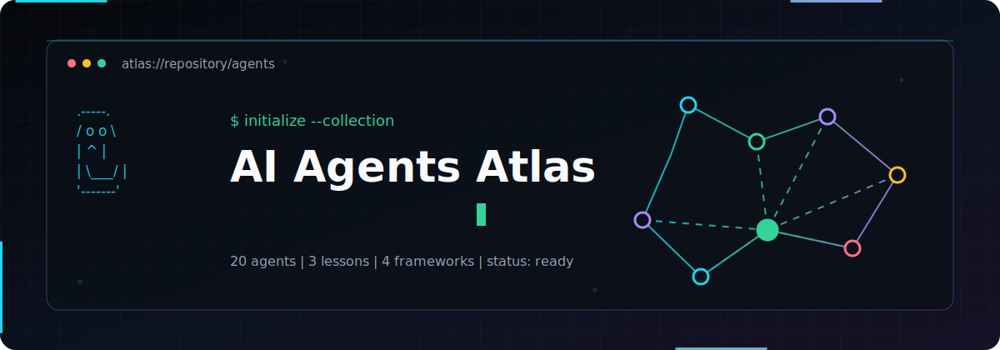

<picture>
  <source media="(prefers-color-scheme: dark)" srcset="assets/banner/dark.svg">
  <source media="(prefers-color-scheme: light)" srcset="assets/banner/light.svg">
  
</picture>

<div align="center">

[](LICENSE)
[](GETTING_STARTED.md)
[](web/)
[](FINAL_REPORT.md)

**A searchable AI-agent catalog with 20 self-contained reference implementations, a three-lesson CrewAI/MCP course, and a React project atlas.**

[Get started](GETTING_STARTED.md) | [Browse projects](PROJECT_INDEX.md) | [Read the architecture](ARCHITECTURE.md) | [Contribute](CONTRIBUTING.md)

</div>

## About this distribution

This repository is a modernized distribution of the upstream 500 AI Agents Projects collection.
The upstream project curates 500+ agent ideas and external references. The downloaded snapshot
modernized here contains **20 local runnable Python agents**, **three course lessons**, and a
**React/Vite catalog**.

Original authorship, the upstream MIT license, project metadata, and external-source links are
preserved. Repository-level documentation, validation, CI, indexing, and brand assets are
modernization work; they do not transfer ownership of upstream or third-party projects. See
[Attribution](ATTRIBUTION.md) for details.

## What is included

- **Runnable agents:** LangChain, LangGraph, CrewAI, and LlamaIndex examples with isolated dependencies.
- **Guided course:** Three progressive CrewAI lessons ending in an MCP-style tool boundary.
- **Project atlas:** A responsive React catalog generated from repository content.
- **Searchable metadata:** Projects indexed by category, framework, difficulty, language, and tags.
- **Reproducible quality checks:** Local validation plus GitHub Actions for structure, Python syntax, dependencies, and the web build.
- **Contribution templates:** A documented contract for adding agents without introducing secrets or unclear licensing.

## Quick start

Use Python 3.11 for the reference agents. Each project owns its environment and dependencies.

```bash
cd agents/01-web-research-agent
uv venv --python 3.11 .venv
# macOS/Linux: source .venv/bin/activate
# Windows PowerShell: .venv\Scripts\Activate.ps1
python -m pip install -r requirements.txt
cp .env.example .env
python agent.py --query "agent reliability patterns"
```

Add only the keys named in that project's `.env.example`. Never commit `.env` files. Most examples
call paid model APIs, so review provider pricing and data-handling terms before running them.

For the catalog:

```bash
cd web
npm ci
npm run dev
```

See [Getting Started](GETTING_STARTED.md) for Windows-specific setup, validation commands, and
troubleshooting.

## Featured local projects

| Project | Category | Framework | Difficulty |
|---|---|---|---|
| [Web Research Agent](agents/01-web-research-agent/) | Research Agents | LangGraph | Intermediate |
| [PDF Q&A Agent](agents/03-pdf-qa-agent/) | RAG | LlamaIndex | Beginner |
| [SQL Query Agent](agents/04-sql-query-agent/) | Data and Analytics | LangChain | Intermediate |
| [Customer Support Agent](agents/13-customer-support-agent/) | RAG and Automation | LangGraph | Advanced |
| [Job Application Agent](agents/18-job-application-agent/) | Workflows | CrewAI | Intermediate |
| [Multi-Agent Debate](agents/20-multi-agent-debate/) | Multi-Agent Systems | LangChain | Advanced |

Browse the complete [Project Index](PROJECT_INDEX.md) or the [category map](docs/categories.md).

## Repository structure

```text
.
|-- agents/                 20 self-contained Python agent projects
|-- crewai_mcp_course/      Three progressive course lessons
|-- web/                    React/Vite searchable catalog
|-- assets/                 Repository-owned brand and screenshot assets
|-- docs/                   Inventory, categories, QA, and preserved upstream docs
|-- scripts/                Deterministic repository validators
|-- templates/              New-project templates
|-- .github/workflows/      CI, dependency review, and release automation
|-- PROJECT_INDEX.md        Searchable local project catalog
`-- FINAL_REPORT.md         Modernization and validation results
```

The existing `agents/` boundary is intentionally retained. A broad physical move into new category
folders would break stable links, make upstream comparison harder, and duplicate classification that
metadata already provides. Categories are therefore represented in the index and documentation.

## Validate the repository

```bash
python scripts/validate_repository.py
python scripts/check_dependencies.py
python scripts/smoke_projects.py
uvx ruff==0.15.22 check --no-cache agents crewai_mcp_course scripts
npm --prefix web ci
npm --prefix web run lint
npm --prefix web test
npm --prefix web run build
```

The dependency and smoke checks require `uv` and fail with a clear installation message when it is
unavailable. CI validates credential-free CLI startup and imports; paid provider requests remain a
manual boundary.

## Documentation

| Document | Purpose |
|---|---|
| [Getting Started](GETTING_STARTED.md) | Setup and first-run paths |
| [Project Index](PROJECT_INDEX.md) | All local projects and metadata |
| [Architecture](ARCHITECTURE.md) | Repository boundaries and data flow |
| [Inventory](docs/inventory.md) | Audit findings and validation state |
| [Categories](docs/categories.md) | Project classification |
| [Contributing](CONTRIBUTING.md) | Contribution and licensing contract |
| [Roadmap](ROADMAP.md) | Bounded maintenance priorities |
| [Changelog](CHANGELOG.md) | Distribution changes |
| [Final Report](FINAL_REPORT.md) | QA evidence and remaining intervention |
| [Third-party notices](THIRD_PARTY_NOTICES.md) | Dependency, provider, and asset rights context |
| [External link audit](docs/external-link-audit.md) | Reachability and licensing review of curated links |

The original long-form catalog is preserved at
[docs/upstream-catalog.md](docs/upstream-catalog.md) for provenance and reference.

## License and acknowledgements

The repository is distributed under the upstream [MIT License](LICENSE). Its original copyright
notice is preserved verbatim there. External projects linked by the catalog remain governed by
their own repositories and licenses. Review those terms before copying or redistributing
third-party code.

Thank you to the original maintainer and every project author represented by the curated links.
