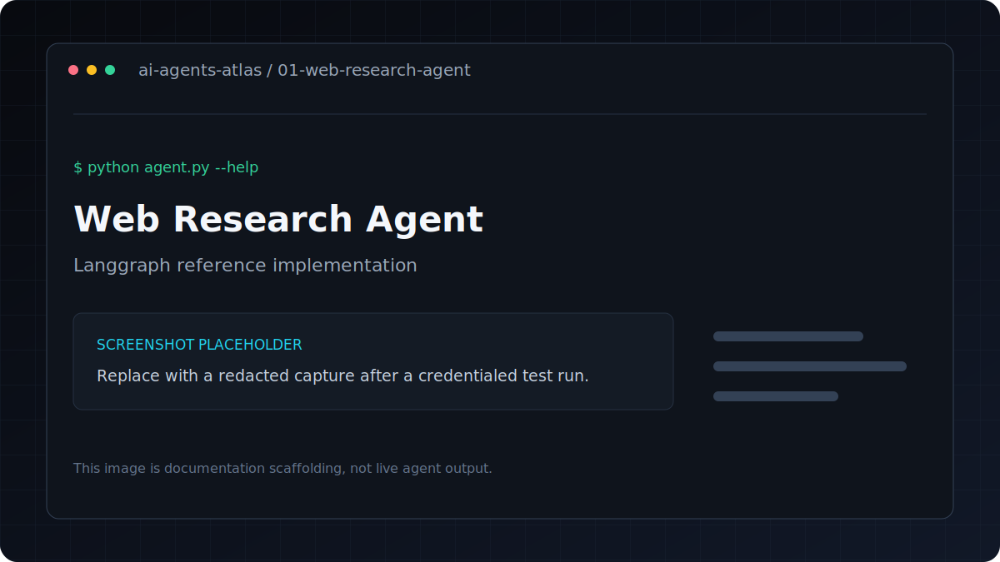

# Web Research Agent

[](../../GETTING_STARTED.md) [](../../PROJECT_INDEX.md) [](metadata.yaml) [](../../LICENSE)

| Field | Value |
|---|---|
| Category | Research Agents / RAG |
| Framework | LangGraph |
| Model | `gpt-4o-mini` |
| Difficulty | Intermediate |
| Original author | `ashishpatel26` |
A LangGraph agent that searches the web for any topic and synthesizes a structured research report.

**Framework**: LangGraph
**LLM**: GPT-4o-mini (OpenAI)
**Search**: Tavily

## Overview

Searches the web for a topic and synthesizes a structured research report.

## Features
1. Takes a research query
2. Searches the web using Tavily (5 results)
3. Synthesizes findings into a structured report (Summary, Key Findings, Sources)

## Architecture

```
User Query → [Search Node] → Tavily Web Search → [Synthesize Node] → GPT-4o → Report
```

---

## Tech stack

| Layer | Technology |
|---|---|
| Runtime | Python 3.11 |
| Agent framework | LangGraph |
| Model | `gpt-4o-mini` |
| Configuration | `python-dotenv` and `.env` |

## Installation
```bash
pip install -r requirements.txt
cp .env.example .env
# Edit .env and add your API keys
```

Get free API keys:
- OpenAI: https://platform.openai.com/api-keys
- Tavily: https://app.tavily.com (free tier available)

## Environment variables

| Variable | Required | Purpose |
|---|---|---|
| `OPENAI_API_KEY` | Yes | Authenticates OpenAI model and embedding requests |
| `TAVILY_API_KEY` | Yes | Authenticates Tavily web-search requests |

Copy `.env.example` to `.env`, replace placeholders locally, and never commit the resulting file.

## Running
```bash
# Default query
python agent.py

# Custom query
python agent.py --query "latest advances in quantum computing"
```

## Folder structure

```text
.
|-- .env.example       Credential contract with placeholders
|-- README.md          Setup, usage, and project notes
|-- agent.py           Command-line entry point
|-- metadata.yaml      Catalog metadata and attribution
`-- requirements.txt   Direct Python dependencies
```

## Example

Verify the command surface without making a provider request:

```bash
python agent.py --help
```

Then use the documented command in **Running** with non-sensitive test input.

## Sample Output

```
🔍 Researching: latest advances in AI agents 2024

============================================================
📄 RESEARCH REPORT
============================================================

## Summary
AI agents have seen significant advances in 2024, with major improvements
in reasoning, tool use, and multi-agent collaboration...

## Key Findings
- LangGraph and CrewAI have emerged as leading frameworks for production agents
- OpenAI's GPT-4o enables real-time multimodal agent interactions
- ...

## Sources
- https://...
```

## Screenshots



This is a labeled documentation placeholder, not a claimed live result. Replace it with a redacted screenshot after a credentialed test run.

## Contributing

Follow the root [contribution guide](../../CONTRIBUTING.md). Keep changes scoped, preserve behavior unless fixing a documented defect, and include validation evidence.

## License and credits

This project is included under the repository [MIT License](../../LICENSE). Original author metadata credits `ashishpatel26`; see [Attribution](../../ATTRIBUTION.md).

## Support

Use the repository issue tracker. Include the project path, operating system, Python version, command, and redacted error output.
