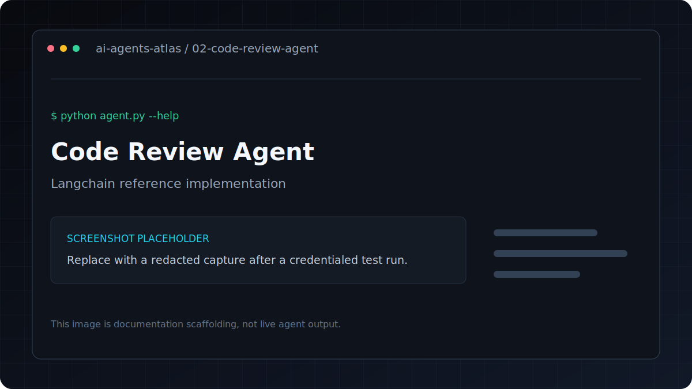

# Code Review Agent

[](../../GETTING_STARTED.md) [](../../PROJECT_INDEX.md) [](metadata.yaml) [](../../LICENSE)

| Field | Value |
|---|---|
| Category | Coding Agents / Developer Tools |
| Framework | LangChain |
| Model | `gpt-4o` |
| Difficulty | Beginner |
| Upstream provenance | [Attribution](../../ATTRIBUTION.md) |
An AI agent that reviews code for bugs, security issues, performance problems, and style violations.

**Framework**: LangChain
**LLM**: GPT-4o

## Overview

Reviews code for bugs, security issues, performance, and style violations.

## Features

- Reviews code for bugs, security issues, performance, and style violations.
- Uses LangChain with `gpt-4o`.
- Keeps dependencies and credentials isolated inside this project.
- Metadata tags: `code-review, software-development, security, quality`.

## Architecture

```text
CLI or file input -> prompt/tool pipeline -> language model -> structured output
```

## Tech stack

| Layer | Technology |
|---|---|
| Runtime | Python 3.11 |
| Agent framework | LangChain |
| Model | `gpt-4o` |
| Configuration | `python-dotenv` and `.env` |

## Installation
```bash
pip install -r requirements.txt
cp .env.example .env
```

## Environment variables

| Variable | Required | Purpose |
|---|---|---|
| `OPENAI_API_KEY` | Yes | Authenticates OpenAI model and embedding requests |

Copy `.env.example` to `.env`, replace placeholders locally, and never commit the resulting file.

## Running
```bash
# Review a file
python agent.py --file path/to/your/code.py

# Review inline code
python agent.py --code "def divide(a, b): return a / b"

# Review non-Python code
python agent.py --file app.js --language javascript
```

## Folder structure

```text
.
|-- .env.example       Credential contract with placeholders
|-- README.md          Setup, usage, and project notes
|-- agent.py           Command-line entry point
|-- metadata.yaml      Catalog metadata and attribution
`-- requirements.txt   Direct Python dependencies
```

## Example

Verify the command surface without making a provider request:

```bash
python agent.py --help
```

Then use the documented command in **Running** with non-sensitive test input.

## Sample Output

```
🔍 Reviewing: example.py

============================================================
📋 CODE REVIEW
============================================================

## Overall: 🟡 Needs Work

### 1. Bugs & Correctness
- `divide(a, b)` has no zero-division check → `ZeroDivisionError` on `b=0`

### 2. Security Issues
- No input validation on external parameters

### 3. Improvements
- Add type hints: `def divide(a: float, b: float) -> float`
- Raise `ValueError` for `b == 0` with descriptive message
```

---

## Screenshots



This is a labeled documentation placeholder, not a claimed live result. Replace it with a redacted screenshot after a credentialed test run.

## Contributing

Follow the root [contribution guide](../../CONTRIBUTING.md). Keep changes scoped, preserve behavior unless fixing a documented defect, and include validation evidence.

## License and credits

This project is included under the repository [MIT License](../../LICENSE). Original upstream authorship and source provenance are preserved in [Attribution](../../ATTRIBUTION.md).

## Support

Use the repository issue tracker. Include the project path, operating system, Python version, command, and redacted error output.
