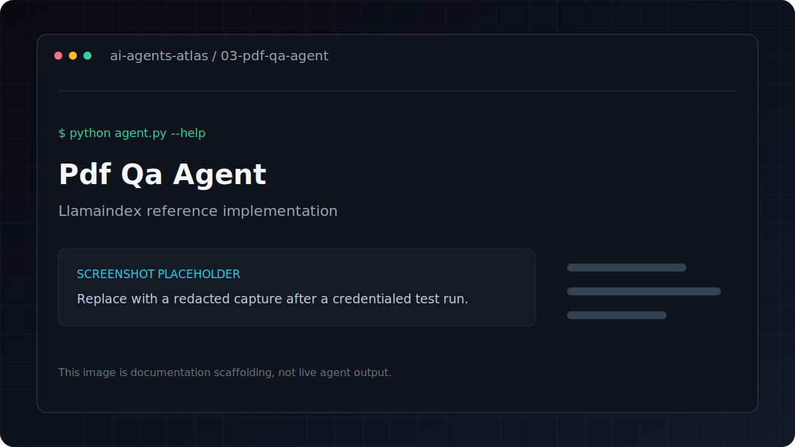

# PDF Q&A Agent

[](../../GETTING_STARTED.md) [](../../PROJECT_INDEX.md) [](metadata.yaml) [](../../LICENSE)

| Field | Value |
|---|---|
| Category | RAG / Document AI |
| Framework | LlamaIndex |
| Model | `gpt-4o-mini` |
| Difficulty | Beginner |
| Original author | `ashishpatel26` |
Loads any PDF and lets you ask questions about it. Supports both single-question and interactive chat modes.

**Framework**: LlamaIndex
**LLM**: GPT-4o-mini

## Overview

Loads a PDF and answers questions about its content with conversation history.

## Features

- Loads a PDF and answers questions about its content with conversation history.
- Uses LlamaIndex with `gpt-4o-mini`.
- Keeps dependencies and credentials isolated inside this project.
- Metadata tags: `pdf, rag, qa, document-analysis, llamaindex`.

## Architecture

```text
Document input -> LlamaIndex loader and vector index -> conversational query -> answer
```

## Tech stack

| Layer | Technology |
|---|---|
| Runtime | Python 3.11 |
| Agent framework | LlamaIndex |
| Model | `gpt-4o-mini` |
| Configuration | `python-dotenv` and `.env` |

## Installation
```bash
pip install -r requirements.txt
cp .env.example .env
```

## Environment variables

| Variable | Required | Purpose |
|---|---|---|
| `OPENAI_API_KEY` | Yes | Authenticates OpenAI model and embedding requests |

Copy `.env.example` to `.env`, replace placeholders locally, and never commit the resulting file.

## Running
```bash
# Interactive Q&A (recommended)
python agent.py --pdf your_document.pdf

# Single question
python agent.py --pdf research_paper.pdf --question "What methodology was used?"
```

## Folder structure

```text
.
|-- .env.example       Credential contract with placeholders
|-- README.md          Setup, usage, and project notes
|-- agent.py           Command-line entry point
|-- metadata.yaml      Catalog metadata and attribution
`-- requirements.txt   Direct Python dependencies
```

## Example

Verify the command surface without making a provider request:

```bash
python agent.py --help
```

Then use the documented command in **Running** with non-sensitive test input.

## Use cases

- Research paper analysis
- Contract review
- Financial report Q&A
- Technical documentation chat

---

## Screenshots



This is a labeled documentation placeholder, not a claimed live result. Replace it with a redacted screenshot after a credentialed test run.

## Contributing

Follow the root [contribution guide](../../CONTRIBUTING.md). Keep changes scoped, preserve behavior unless fixing a documented defect, and include validation evidence.

## License and credits

This project is included under the repository [MIT License](../../LICENSE). Original author metadata credits `ashishpatel26`; see [Attribution](../../ATTRIBUTION.md).

## Support

Use the repository issue tracker. Include the project path, operating system, Python version, command, and redacted error output.
