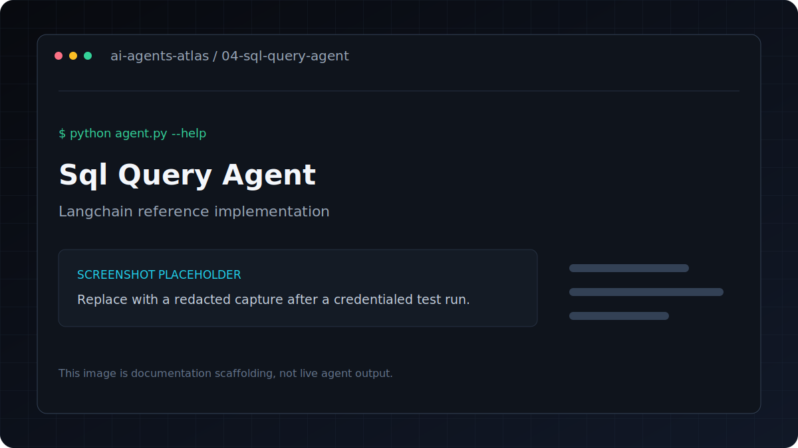

# SQL Query Agent

[](../../GETTING_STARTED.md) [](../../PROJECT_INDEX.md) [](metadata.yaml) [](../../LICENSE)

| Field | Value |
|---|---|
| Category | Data and Analytics |
| Framework | LangChain |
| Model | `gpt-4o-mini` |
| Difficulty | Intermediate |
| Original author | `ashishpatel26` |
Connects to any SQLite database and answers natural language questions by generating and executing SQL.

**Framework**: LangChain
**LLM**: GPT-4o-mini

## Overview

Answers natural language questions about SQL databases by generating and executing queries.

## Features

- Answers natural language questions about SQL databases by generating and executing queries.
- Uses LangChain with `gpt-4o-mini`.
- Keeps dependencies and credentials isolated inside this project.
- Metadata tags: `sql, database, natural-language, data-analysis`.

## Architecture

```
Natural Language → LLM (generates SQL) → SQLite → LLM (formats answer) → Response
```

---

## Tech stack

| Layer | Technology |
|---|---|
| Runtime | Python 3.11 |
| Agent framework | LangChain |
| Model | `gpt-4o-mini` |
| Configuration | `python-dotenv` and `.env` |

## Installation
```bash
pip install -r requirements.txt
cp .env.example .env
```

## Environment variables

| Variable | Required | Purpose |
|---|---|---|
| `OPENAI_API_KEY` | Yes | Authenticates OpenAI model and embedding requests |

Copy `.env.example` to `.env`, replace placeholders locally, and never commit the resulting file.

## Running
```bash
# Demo mode — creates a sample e-commerce database automatically
python agent.py

# Your own database
python agent.py --db path/to/your/database.sqlite

# Single question
python agent.py --question "What is the total revenue by country?"
```

Databases open in read-only mode by default. Use `--allow-write` only with a disposable database
if you intentionally want the generated SQL agent to be able to mutate data.

## Folder structure

```text
.
|-- .env.example       Credential contract with placeholders
|-- README.md          Setup, usage, and project notes
|-- agent.py           Command-line entry point
|-- metadata.yaml      Catalog metadata and attribution
`-- requirements.txt   Direct Python dependencies
```

## Example

Verify the command surface without making a provider request:

```bash
python agent.py --help
```

Then use the documented command in **Running** with non-sensitive test input.

## Example Questions

- "How many customers do we have in each country?"
- "What are the top 3 best-selling products?"
- "What was the total revenue last month?"
- "Which customer has spent the most?"

## Screenshots



This is a labeled documentation placeholder, not a claimed live result. Replace it with a redacted screenshot after a credentialed test run.

## Responsible use

Run generated SQL against a disposable or read-only database first. Review every query before
granting write permissions, and never expose production credentials to the model.

## Contributing

Follow the root [contribution guide](../../CONTRIBUTING.md). Keep changes scoped, preserve behavior unless fixing a documented defect, and include validation evidence.

## License and credits

This project is included under the repository [MIT License](../../LICENSE). Original author metadata credits `ashishpatel26`; see [Attribution](../../ATTRIBUTION.md).

## Support

Use the repository issue tracker. Include the project path, operating system, Python version, command, and redacted error output.
