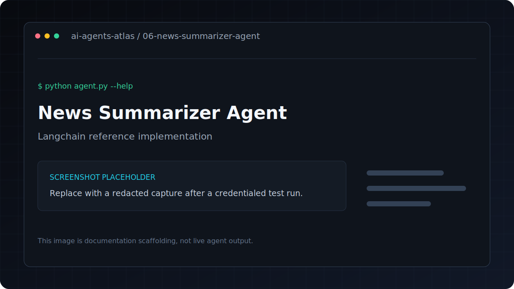

# News Summarizer Agent

[](../../GETTING_STARTED.md) [](../../PROJECT_INDEX.md) [](metadata.yaml) [](../../LICENSE)

| Field | Value |
|---|---|
| Category | Research Agents / Automation |
| Framework | LangChain |
| Model | `gpt-4o-mini` |
| Difficulty | Beginner |
| Original author | `ashishpatel26` |
Fetches news articles on any topic and produces a structured briefing with key themes and insights.

**Framework**: LangChain
**LLM**: GPT-4o-mini
**Data**: NewsAPI (optional — runs with mock data without a key)

## Overview

Fetches news on any topic and produces a structured briefing with key themes.

## Features

- Fetches news on any topic and produces a structured briefing with key themes.
- Uses LangChain with `gpt-4o-mini`.
- Keeps dependencies and credentials isolated inside this project.
- Metadata tags: `news, summarization, media, nlp`.

## Architecture

```text
CLI or file input -> prompt/tool pipeline -> language model -> structured output
```

## Tech stack

| Layer | Technology |
|---|---|
| Runtime | Python 3.11 |
| Agent framework | LangChain |
| Model | `gpt-4o-mini` |
| Configuration | `python-dotenv` and `.env` |

## Installation
```bash
pip install -r requirements.txt
cp .env.example .env
```

## Environment variables

| Variable | Required | Purpose |
|---|---|---|
| `OPENAI_API_KEY` | Yes | Authenticates OpenAI model and embedding requests |
| `NEWS_API_KEY` | No | Enables live NewsAPI retrieval; optional when documented by the project |

Copy `.env.example` to `.env`, replace placeholders locally, and never commit the resulting file.

## Running
```bash
python agent.py --topic "artificial intelligence"
python agent.py --topic "climate change" --count 10
```

Works without a NewsAPI key using sample data. For real news, get a free key at newsapi.org.

---

## Folder structure

```text
.
|-- .env.example       Credential contract with placeholders
|-- README.md          Setup, usage, and project notes
|-- agent.py           Command-line entry point
|-- metadata.yaml      Catalog metadata and attribution
`-- requirements.txt   Direct Python dependencies
```

## Example

Verify the command surface without making a provider request:

```bash
python agent.py --help
```

Then use the documented command in **Running** with non-sensitive test input.

## Screenshots



This is a labeled documentation placeholder, not a claimed live result. Replace it with a redacted screenshot after a credentialed test run.

## Contributing

Follow the root [contribution guide](../../CONTRIBUTING.md). Keep changes scoped, preserve behavior unless fixing a documented defect, and include validation evidence.

## License and credits

This project is included under the repository [MIT License](../../LICENSE). Original author metadata credits `ashishpatel26`; see [Attribution](../../ATTRIBUTION.md).

## Support

Use the repository issue tracker. Include the project path, operating system, Python version, command, and redacted error output.
