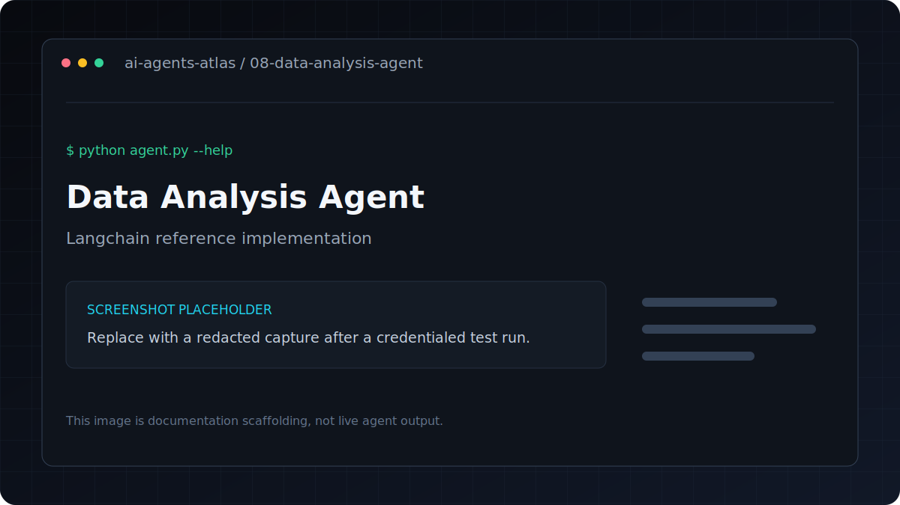

# Data Analysis Agent

[](../../GETTING_STARTED.md) [](../../PROJECT_INDEX.md) [](metadata.yaml) [](../../LICENSE)

| Field | Value |
|---|---|
| Category | Data and Analytics |
| Framework | LangChain |
| Model | `gpt-4o` |
| Difficulty | Intermediate |
| Upstream provenance | [Attribution](../../ATTRIBUTION.md) |
Chat with your data. Load a CSV or XLSX file and ask analytical questions in natural language.

**Framework**: LangChain (Pandas Agent)
**LLM**: GPT-4o

## Overview

Chat with CSV/XLSX data using natural language queries powered by pandas.

## Features

- Chat with CSV/XLSX data using natural language queries powered by pandas.
- Accepts CSV and XLSX input; legacy XLS files are intentionally unsupported.
- Uses LangChain with `gpt-4o`.
- Keeps dependencies and credentials isolated inside this project.
- Metadata tags: `data-analysis, pandas, csv, analytics, natural-language`.

## Architecture

```text
CLI or file input -> prompt/tool pipeline -> language model -> structured output
```

## Tech stack

| Layer | Technology |
|---|---|
| Runtime | Python 3.11 |
| Agent framework | LangChain |
| Model | `gpt-4o` |
| Configuration | `python-dotenv` and `.env` |

## Installation
```bash
pip install -r requirements.txt
cp .env.example .env
```

## Environment variables

| Variable | Required | Purpose |
|---|---|---|
| `OPENAI_API_KEY` | Yes | Authenticates OpenAI model and embedding requests |

Copy `.env.example` to `.env`, replace placeholders locally, and never commit the resulting file.

## Running
```bash
# Demo mode — creates sample sales data automatically
python agent.py --allow-dangerous-code

# Your own data
python agent.py --file your_data.csv --allow-dangerous-code

# Single question
python agent.py --file sales.csv --question "What is the monthly revenue trend?" --allow-dangerous-code
```

## Folder structure

```text
.
|-- .env.example       Credential contract with placeholders
|-- README.md          Setup, usage, and project notes
|-- agent.py           Command-line entry point
|-- metadata.yaml      Catalog metadata and attribution
`-- requirements.txt   Direct Python dependencies
```

## Example

Verify the command surface without making a provider request:

```bash
python agent.py --help
```

Then use the documented command in **Running** with non-sensitive test input.

## Safety Note

This demo uses LangChain's pandas agent, which executes model-generated Python code.
Use `--allow-dangerous-code` only with trusted prompts and non-sensitive local data.

## Example Questions

- "What is the total revenue by product?"
- "Which region performs best?"
- "Show the correlation between quantity and revenue"
- "What are the top 5 selling products?"

---

## Screenshots



This is a labeled documentation placeholder, not a claimed live result. Replace it with a redacted screenshot after a credentialed test run.

## Responsible use

The optional execution mode can run model-generated Python. Use only non-sensitive test data, review
the generated code, and keep execution disabled unless you understand the risk.

## Contributing

Follow the root [contribution guide](../../CONTRIBUTING.md). Keep changes scoped, preserve behavior unless fixing a documented defect, and include validation evidence.

## License and credits

This project is included under the repository [MIT License](../../LICENSE). Original upstream authorship and source provenance are preserved in [Attribution](../../ATTRIBUTION.md).

## Support

Use the repository issue tracker. Include the project path, operating system, Python version, command, and redacted error output.
