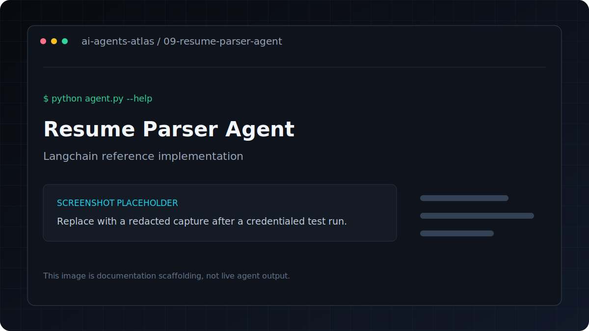

# Resume Parser Agent

[](../../GETTING_STARTED.md) [](../../PROJECT_INDEX.md) [](metadata.yaml) [](../../LICENSE)

| Field | Value |
|---|---|
| Category | Document AI / Workflows |
| Framework | LangChain |
| Model | `gpt-4o-mini` |
| Difficulty | Beginner |
| Upstream provenance | [Attribution](../../ATTRIBUTION.md) |
Parses resumes (TXT or PDF) into structured JSON and optionally scores candidate fit against a job description.

**Framework**: LangChain
**LLM**: GPT-4o-mini

## Overview

Parses resumes to structured JSON and scores candidate fit against job descriptions.

## Features

- Parses resumes to structured JSON and scores candidate fit against job descriptions.
- Uses LangChain with `gpt-4o-mini`.
- Keeps dependencies and credentials isolated inside this project.
- Metadata tags: `hr, recruitment, resume, nlp, parsing`.

## Architecture

```text
CLI or file input -> prompt/tool pipeline -> language model -> structured output
```

## Tech stack

| Layer | Technology |
|---|---|
| Runtime | Python 3.11 |
| Agent framework | LangChain |
| Model | `gpt-4o-mini` |
| Configuration | `python-dotenv` and `.env` |

## Installation
```bash
pip install -r requirements.txt
cp .env.example .env
```

## Environment variables

| Variable | Required | Purpose |
|---|---|---|
| `OPENAI_API_KEY` | Yes | Authenticates OpenAI model and embedding requests |

Copy `.env.example` to `.env`, replace placeholders locally, and never commit the resulting file.

## Running
```bash
# Parse only (uses built-in sample resume)
python agent.py

# Parse your resume
python agent.py --resume path/to/resume.pdf

# Parse + fit score
python agent.py --resume resume.pdf --job-desc "Senior Python Engineer with K8s experience..."
```

## Folder structure

```text
.
|-- .env.example       Credential contract with placeholders
|-- README.md          Setup, usage, and project notes
|-- agent.py           Command-line entry point
|-- metadata.yaml      Catalog metadata and attribution
`-- requirements.txt   Direct Python dependencies
```

## Example

Verify the command surface without making a provider request:

```bash
python agent.py --help
```

Then use the documented command in **Running** with non-sensitive test input.

## Output includes

- Structured JSON: name, email, skills, experience, education
- Candidate summary
- Fit score (0-100) vs job description
- Hire/Consider/Pass recommendation

---

## Screenshots



This is a labeled documentation placeholder, not a claimed live result. Replace it with a redacted screenshot after a credentialed test run.

## Responsible use

Resumes contain personal data and the fit score can affect employment decisions. Obtain consent,
minimize retained data, verify extracted facts, and do not use the score as an autonomous hiring
decision.

## Contributing

Follow the root [contribution guide](../../CONTRIBUTING.md). Keep changes scoped, preserve behavior unless fixing a documented defect, and include validation evidence.

## License and credits

This project is included under the repository [MIT License](../../LICENSE). Original upstream authorship and source provenance are preserved in [Attribution](../../ATTRIBUTION.md).

## Support

Use the repository issue tracker. Include the project path, operating system, Python version, command, and redacted error output.
