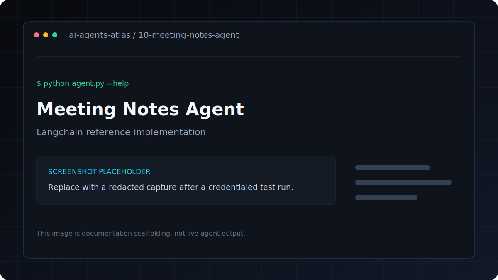

# Meeting Notes Agent

[](../../GETTING_STARTED.md) [](../../PROJECT_INDEX.md) [](metadata.yaml) [](../../LICENSE)

| Field | Value |
|---|---|
| Category | Automation / Workflows |
| Framework | LangChain |
| Model | `gpt-4o-mini` |
| Difficulty | Beginner |
| Upstream provenance | [Attribution](../../ATTRIBUTION.md) |
Converts meeting transcripts into structured notes with summary, action items, decisions, and follow-ups.

**Framework**: LangChain
**LLM**: GPT-4o-mini

## Overview

Converts meeting transcripts into structured notes with action items and decisions.

## Features

- Converts meeting transcripts into structured notes with action items and decisions.
- Uses LangChain with `gpt-4o-mini`.
- Keeps dependencies and credentials isolated inside this project.
- Metadata tags: `productivity, meetings, summarization, action-items`.

## Architecture

```text
CLI or file input -> prompt/tool pipeline -> language model -> structured output
```

## Tech stack

| Layer | Technology |
|---|---|
| Runtime | Python 3.11 |
| Agent framework | LangChain |
| Model | `gpt-4o-mini` |
| Configuration | `python-dotenv` and `.env` |

## Installation
```bash
pip install -r requirements.txt
cp .env.example .env
```

## Environment variables

| Variable | Required | Purpose |
|---|---|---|
| `OPENAI_API_KEY` | Yes | Authenticates OpenAI model and embedding requests |

Copy `.env.example` to `.env`, replace placeholders locally, and never commit the resulting file.

## Running
```bash
# Use built-in sample transcript
python agent.py

# Your own transcript file
python agent.py --transcript meeting_transcript.txt

# Inline text
python agent.py --text "Alice: Let's ship by Friday. Bob: I need 2 more days for testing..."

# Custom output path
python agent.py --transcript meeting_transcript.txt --output sprint_notes.md
```

## Folder structure

```text
.
|-- .env.example       Credential contract with placeholders
|-- README.md          Setup, usage, and project notes
|-- agent.py           Command-line entry point
|-- metadata.yaml      Catalog metadata and attribution
`-- requirements.txt   Direct Python dependencies
```

## Example

Verify the command surface without making a provider request:

```bash
python agent.py --help
```

Then use the documented command in **Running** with non-sensitive test input.

## Output

Saves structured markdown to `meeting_notes.md` by default. If that file already exists,
the agent writes a timestamped file instead. The output includes:
- Executive summary
- Key decisions
- Action items with owners and due dates
- Blockers
- Next meeting time

---

## Screenshots



This is a labeled documentation placeholder, not a claimed live result. Replace it with a redacted screenshot after a credentialed test run.

## Responsible use

Confirm recording and transcription consent for every participant. Remove confidential material
before provider submission and verify names, decisions, and assigned actions in the output.

## Contributing

Follow the root [contribution guide](../../CONTRIBUTING.md). Keep changes scoped, preserve behavior unless fixing a documented defect, and include validation evidence.

## License and credits

This project is included under the repository [MIT License](../../LICENSE). Original upstream authorship and source provenance are preserved in [Attribution](../../ATTRIBUTION.md).

## Support

Use the repository issue tracker. Include the project path, operating system, Python version, command, and redacted error output.
