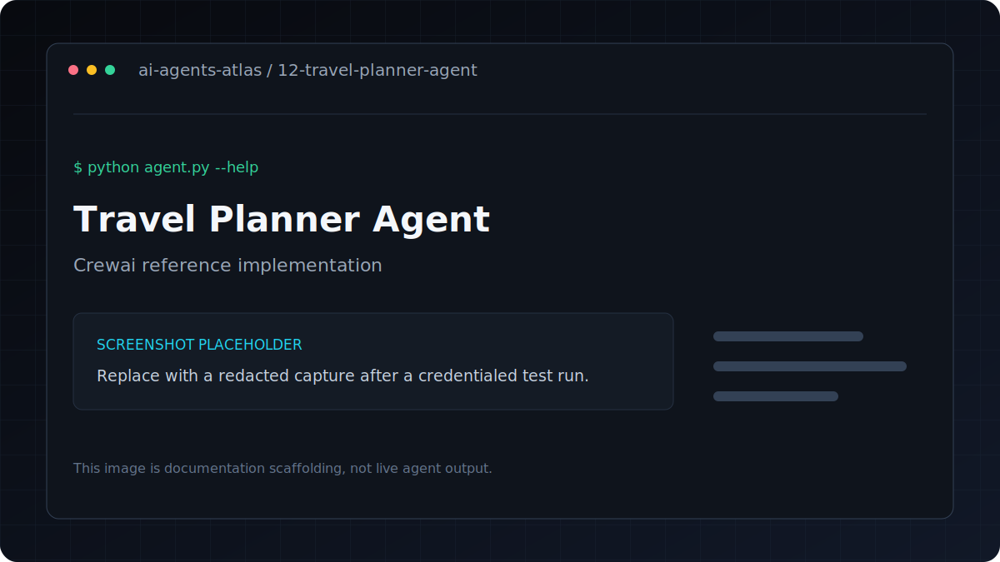

# Travel Planner Agent

[](../../GETTING_STARTED.md) [](../../PROJECT_INDEX.md) [](metadata.yaml) [](../../LICENSE)

| Field | Value |
|---|---|
| Category | Multi-Agent Systems / Workflows |
| Framework | CrewAI |
| Model | `gpt-4o-mini` |
| Difficulty | Intermediate |
| Original author | `ashishpatel26` |
Three-agent CrewAI system that creates personalized travel itineraries with destination research, day-by-day plans, and budget breakdown.

**Framework**: CrewAI
**LLM**: GPT-4o-mini

## Overview

Multi-agent CrewAI system creating personalized travel itineraries with budget planning.

## Features

- Multi-agent CrewAI system creating personalized travel itineraries with budget planning.
- Uses CrewAI with `gpt-4o-mini`.
- Keeps dependencies and credentials isolated inside this project.
- Metadata tags: `travel, planning, crewai, itinerary, budget`.

## Architecture

```text
CLI input -> specialist agents and tasks -> sequential CrewAI process -> final output
```

## Tech stack

| Layer | Technology |
|---|---|
| Runtime | Python 3.11 |
| Agent framework | CrewAI |
| Model | `gpt-4o-mini` |
| Configuration | `python-dotenv` and `.env` |

## Installation
```bash
pip install -r requirements.txt
cp .env.example .env
```

## Environment variables

| Variable | Required | Purpose |
|---|---|---|
| `OPENAI_API_KEY` | Yes | Authenticates OpenAI model and embedding requests |

Copy `.env.example` to `.env`, replace placeholders locally, and never commit the resulting file.

## Running
```bash
python agent.py --destination "Tokyo, Japan" --days 7 --budget 3000
python agent.py --destination "Paris, France" --days 5 --budget 5000 --interests "art, wine, architecture"
```

---

## Folder structure

```text
.
|-- .env.example       Credential contract with placeholders
|-- README.md          Setup, usage, and project notes
|-- agent.py           Command-line entry point
|-- metadata.yaml      Catalog metadata and attribution
`-- requirements.txt   Direct Python dependencies
```

## Example

Verify the command surface without making a provider request:

```bash
python agent.py --help
```

Then use the documented command in **Running** with non-sensitive test input.

## Screenshots



This is a labeled documentation placeholder, not a claimed live result. Replace it with a redacted screenshot after a credentialed test run.

## Contributing

Follow the root [contribution guide](../../CONTRIBUTING.md). Keep changes scoped, preserve behavior unless fixing a documented defect, and include validation evidence.

## License and credits

This project is included under the repository [MIT License](../../LICENSE). Original author metadata credits `ashishpatel26`; see [Attribution](../../ATTRIBUTION.md).

## Support

Use the repository issue tracker. Include the project path, operating system, Python version, command, and redacted error output.
