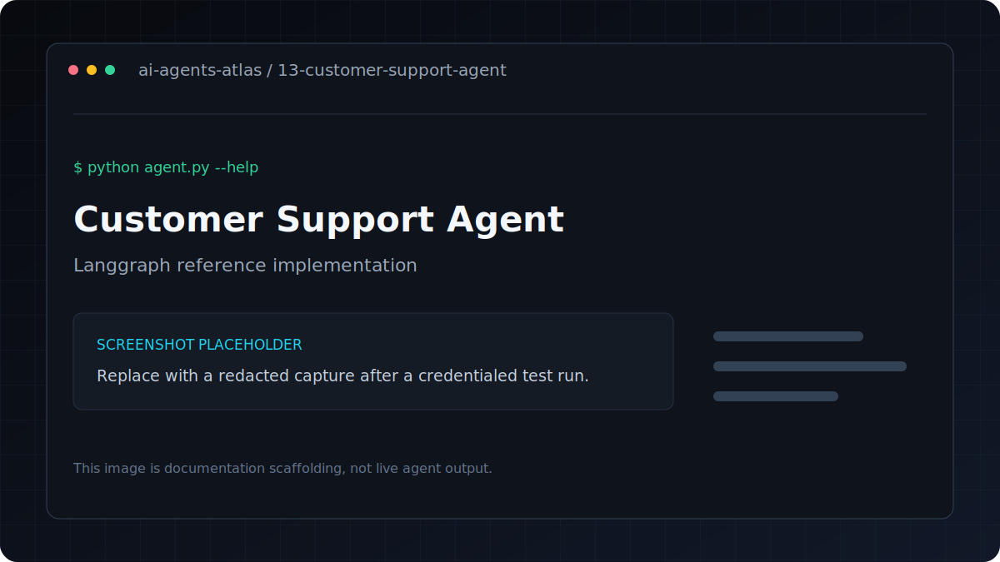

# Customer Support Agent

[](../../GETTING_STARTED.md) [](../../PROJECT_INDEX.md) [](metadata.yaml) [](../../LICENSE)

| Field | Value |
|---|---|
| Category | RAG / Automation |
| Framework | LangGraph |
| Model | `gpt-4o-mini` |
| Difficulty | Advanced |
| Upstream provenance | [Attribution](../../ATTRIBUTION.md) |
LangGraph-powered support agent with RAG knowledge base and automatic escalation routing.

**Framework**: LangGraph + FAISS
**LLM**: GPT-4o-mini

## Overview

RAG-powered customer support agent with escalation routing using LangGraph.

## Features

- RAG over product knowledge base
- Automatic escalation detection for sensitive issues (billing disputes, data loss, etc.)
- Conversation history maintained
- Easily swap in your own knowledge base docs

---

## Architecture

```text
CLI or file input -> typed graph state -> tools/model nodes -> structured terminal output
```

## Tech stack

| Layer | Technology |
|---|---|
| Runtime | Python 3.11 |
| Agent framework | LangGraph |
| Model | `gpt-4o-mini` |
| Configuration | `python-dotenv` and `.env` |

## Installation
```bash
pip install -r requirements.txt
cp .env.example .env
```

## Environment variables

| Variable | Required | Purpose |
|---|---|---|
| `OPENAI_API_KEY` | Yes | Authenticates OpenAI model and embedding requests |

Copy `.env.example` to `.env`, replace placeholders locally, and never commit the resulting file.

## Running
```bash
python agent.py

# Use your own .txt/.md knowledge base files
python agent.py --kb-dir docs/
```

## Folder structure

```text
.
|-- .env.example       Credential contract with placeholders
|-- README.md          Setup, usage, and project notes
|-- agent.py           Command-line entry point
|-- metadata.yaml      Catalog metadata and attribution
`-- requirements.txt   Direct Python dependencies
```

## Example

Verify the command surface without making a provider request:

```bash
python agent.py --help
```

Then use the documented command in **Running** with non-sensitive test input.

## Screenshots



This is a labeled documentation placeholder, not a claimed live result. Replace it with a redacted screenshot after a credentialed test run.

## Responsible use

Use only knowledge-base content you are allowed to process. The sample escalation path generates a
local response; it does not create a real case or guarantee an SLA unless you add and verify an
external integration.

## Contributing

Follow the root [contribution guide](../../CONTRIBUTING.md). Keep changes scoped, preserve behavior unless fixing a documented defect, and include validation evidence.

## License and credits

This project is included under the repository [MIT License](../../LICENSE). Original upstream authorship and source provenance are preserved in [Attribution](../../ATTRIBUTION.md).

## Support

Use the repository issue tracker. Include the project path, operating system, Python version, command, and redacted error output.
