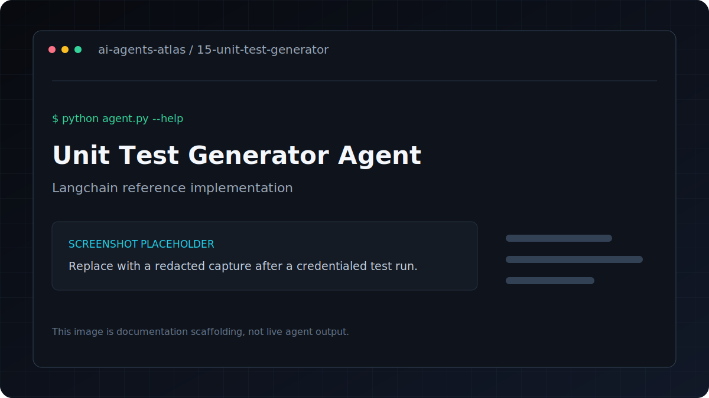

# Unit Test Generator Agent

[](../../GETTING_STARTED.md) [](../../PROJECT_INDEX.md) [](metadata.yaml) [](../../LICENSE)

| Field | Value |
|---|---|
| Category | Coding Agents / Developer Tools |
| Framework | LangChain |
| Model | `gpt-4o` |
| Difficulty | Intermediate |
| Upstream provenance | [Attribution](../../ATTRIBUTION.md) |
Analyzes Python code and generates comprehensive pytest test suites — happy paths, edge cases, and error conditions.

**Framework**: LangChain
**LLM**: GPT-4o

## Overview

Generates comprehensive pytest test suites from Python code.

## Features

- Generates comprehensive pytest test suites from Python code.
- Uses LangChain with `gpt-4o`.
- Keeps dependencies and credentials isolated inside this project.
- Metadata tags: `testing, pytest, code-quality, automation, software-development`.

## Architecture

```text
CLI or file input -> prompt/tool pipeline -> language model -> structured output
```

## Tech stack

| Layer | Technology |
|---|---|
| Runtime | Python 3.11 |
| Agent framework | LangChain |
| Model | `gpt-4o` |
| Configuration | `python-dotenv` and `.env` |

## Installation
```bash
pip install -r requirements.txt
cp .env.example .env
```

## Environment variables

| Variable | Required | Purpose |
|---|---|---|
| `OPENAI_API_KEY` | Yes | Authenticates OpenAI model and embedding requests |

Copy `.env.example` to `.env`, replace placeholders locally, and never commit the resulting file.

## Running
```bash
# Generate tests for a Python file
python agent.py --file my_module.py

# Generate tests for inline code
python agent.py --code "def divide(a, b): return a / b"

# Specify output file
python agent.py --file utils.py --output tests/test_utils.py
```

## Folder structure

```text
.
|-- .env.example       Credential contract with placeholders
|-- README.md          Setup, usage, and project notes
|-- agent.py           Command-line entry point
|-- metadata.yaml      Catalog metadata and attribution
`-- requirements.txt   Direct Python dependencies
```

## Example

Input: `shopping_cart.py` with add_item, remove_item, total methods
Output: `test_shopping.py` with 20+ pytest tests using fixtures, parametrize, and mocking

---

## Screenshots



This is a labeled documentation placeholder, not a claimed live result. Replace it with a redacted screenshot after a credentialed test run.

## Responsible use

Generated tests are untrusted source code. Parse, review, and run them in an isolated environment
before committing them; a generated test suite is not evidence that the underlying code is correct.

## Contributing

Follow the root [contribution guide](../../CONTRIBUTING.md). Keep changes scoped, preserve behavior unless fixing a documented defect, and include validation evidence.

## License and credits

This project is included under the repository [MIT License](../../LICENSE). Original upstream authorship and source provenance are preserved in [Attribution](../../ATTRIBUTION.md).

## Support

Use the repository issue tracker. Include the project path, operating system, Python version, command, and redacted error output.
