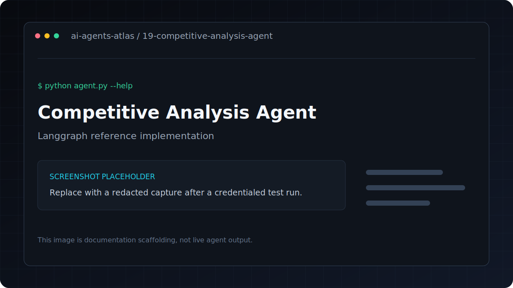

# Competitive Analysis Agent

[](../../GETTING_STARTED.md) [](../../PROJECT_INDEX.md) [](metadata.yaml) [](../../LICENSE)

| Field | Value |
|---|---|
| Category | Research Agents / Workflows |
| Framework | LangGraph |
| Model | `gpt-4o` |
| Difficulty | Advanced |
| Original author | `ashishpatel26` |
LangGraph multi-step agent that identifies competitors, analyzes each one, and generates a strategic competitive report.

**Framework**: LangGraph
**LLM**: GPT-4o-mini + GPT-4o

## Overview

Multi-step LangGraph agent for comprehensive competitive landscape analysis.

## Features

- Multi-step LangGraph agent for comprehensive competitive landscape analysis.
- Uses LangGraph with `gpt-4o`.
- Keeps dependencies and credentials isolated inside this project.
- Metadata tags: `business, competitive-analysis, strategy, langgraph, market-research`.

## Architecture

```text
CLI or file input -> typed graph state -> tools/model nodes -> structured terminal output
```

## Tech stack

| Layer | Technology |
|---|---|
| Runtime | Python 3.11 |
| Agent framework | LangGraph |
| Model | `gpt-4o` |
| Configuration | `python-dotenv` and `.env` |

## Installation
```bash
pip install -r requirements.txt
cp .env.example .env
```

## Environment variables

| Variable | Required | Purpose |
|---|---|---|
| `OPENAI_API_KEY` | Yes | Authenticates OpenAI model and embedding requests |

Copy `.env.example` to `.env`, replace placeholders locally, and never commit the resulting file.

## Running
```bash
python agent.py --company "Notion" --industry "productivity software"
python agent.py --company "Stripe" --industry "payment processing"
python agent.py --company "Figma" --industry "design tools"
```

## Folder structure

```text
.
|-- .env.example       Credential contract with placeholders
|-- README.md          Setup, usage, and project notes
|-- agent.py           Command-line entry point
|-- metadata.yaml      Catalog metadata and attribution
`-- requirements.txt   Direct Python dependencies
```

## Example

Verify the command surface without making a provider request:

```bash
python agent.py --help
```

Then use the documented command in **Running** with non-sensitive test input.

## Output

- 5 competitor analyses
- Executive summary
- Market gaps and opportunities
- 5 strategic recommendations
- Threat assessment by competitor

---

## Screenshots



This is a labeled documentation placeholder, not a claimed live result. Replace it with a redacted screenshot after a credentialed test run.

## Responsible use

This implementation has no live market-research tool, so its analysis may be stale or unsupported.
Add dated sources and independently verify material claims before using the report for strategy.

## Contributing

Follow the root [contribution guide](../../CONTRIBUTING.md). Keep changes scoped, preserve behavior unless fixing a documented defect, and include validation evidence.

## License and credits

This project is included under the repository [MIT License](../../LICENSE). Original author metadata credits `ashishpatel26`; see [Attribution](../../ATTRIBUTION.md).

## Support

Use the repository issue tracker. Include the project path, operating system, Python version, command, and redacted error output.
